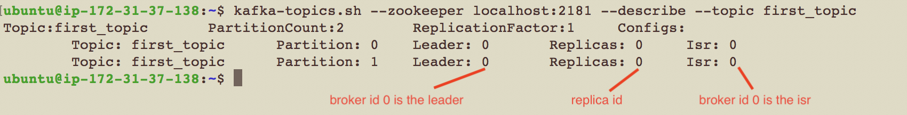

# Console Producer and Consumer


### Test Kafka Installation by Producing and Consuming Data

#### bash profile
	source ~/.bashrc


### Check Zookeeper and Kafka

    ## check zookeeper
    echo stat | nc localhost 2181
    
    ## check kafka
    echo dump | nc localhost 2181 | grep brokers


### Start if not started, Zookeeper and Kafka

    ## start zookeeper
    nohup zookeeper-server-start.sh -daemon config/zookeeper.properties > /dev/null 2>&1 &
    
    ## start kafka
    nohup kafka-server-start.sh -daemon config/server.properties > /dev/null 2>&1 &

    
    
### Create topic

    kafka-topics.sh --create --zookeeper localhost:2181 --replication-factor 1 --partitions 1 --topic KafkaEssentials

    kafka-topics.sh --list --zookeeper localhost:2181
    
    kafka-topics.sh --describe --topic KafkaEssentials --zookeeper localhost:2181




<br>

### Create a console producer that publishes to topic KafkaEssentials

    kafka-console-producer.sh --broker-list localhost:9092 --topic KafkaEssentials
    
    # note: you can pass properties from console
        kafka-console-producer.sh --broker-list localhost:9092 --topic KafkaEssentials --producer-property acks=all


Publish some text to the topic

    Hello, World
    My name is xyz
    Kafka, I loved your book the Metamorphosis

### Create console consumer

Open a new terminal window and ssh into your instance

Create a consumer that reads from the beginning

    kafka-console-consumer.sh --bootstrap-server localhost:9092 --topic KafkaEssentials --from-beginning

What is the result? 

Your new consumer should print the previous messages you sent to the broker

### Publish some more text to the topic called KafkaEssential

    hello, Kafka
    thanks for being so available

Now check your consumer and see if the message was recieved by consumer

Congrats! you have successfully set up a messaging Queue and Topic


### Create another consumer
Open a new terminal window and ssh into your instance

    kafka-console-consumer.sh --bootstrap-server localhost:9092 --topic KafkaEssentials

Check both consumers. What is the result?
    
Your new consumer should be blank as we did not pass --from-beginning flag to consumer
    
Type some text in your producer.

    kafka, please help me to decouple from all these services
    

Check your consumer.  What is the result?
<b>Both consumers will receive the new messages</b>

Close your consumers (not producers)

    ctrl-z (in both consumer tabs, not the producer)
    
    
### Create another topic

Open a new terminal window

    kafka-topics.sh --create --zookeeper localhost:2181 --replication-factor 1 --partitions 1 --topic KafkaEssentials-2


    kafka-topics.sh --list --zookeeper localhost:2181

### Crate a new producer that publishes to new topic


    kafka-console-producer.sh --broker-list localhost:9092 --topic KafkaEssentials-2

### Create a new consumer that consumers from both topics

    kafka-console-consumer.sh --bootstrap-server localhost:9092 --whitelist "KafkaEssentials|KafkaEssentials-2"
    
Now publish to both producers.

Check your new consumer to see the behavior of both topics.


### Create a producer for which topic has not been created

    kafka-console-producer.sh --broker-list localhost:9092 --topic KafkaEssentials-3
    
    ## if you enter a message in this producer console; it will give a warning that leader is not elected. But since Kafka producers recover from errors, running the above command will create a topic and elect a leader
    
    kafka-topics.sh --describe --topic KafkaEssentials-3 --zookeeper localhost:2181
    
Kafka will auto-create the topic with `1` replication-factor and `1` partition. 

- Note: you can change the default number of partitions in `server.properties` ===> `num.partitions (default is 1)`


### check number of messages in a topic

```
kafka-run-class.sh kafka.tools.GetOffsetShell --broker-list localhost:9092 --topic KafkaEssentials-3 --time -1
```


# Trouble Shooting

    "If you get an error that kafka is running currently you can kill the process."

    ps -fA | grep ./bin/kafka-server-start.sh

    sudo kill -9 <process-id>

    "Faile to acquire lock on file .lock in /kafka/logs. A Kafka instance in another process or thread is using this directory"

    sudo rm /kafka/logs/.lock